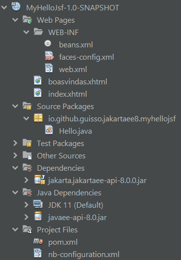

# MyHelloJsf
Simple Jakarta EE Web Application with a JSF like "Hello, World!".

## Suggested analysis order

1. [web.xml](/src/main/webapp/index.xhtml)
2. [Hello.java](/src/main/java/io/github/guisso/jakartaee8/myhellojsf/Hello.java)
3. [index.html](/src/main/webapp/index.xhtml)
4. [boasvindas.xhtml](/src/main/webapp/boasvindas.xhtml)

## Reference

A Web Module That Uses Jakarta Server Faces Technology: The hello1 Example

<https://eclipse-ee4j.github.io/jakartaee-tutorial/webapp003.html>
